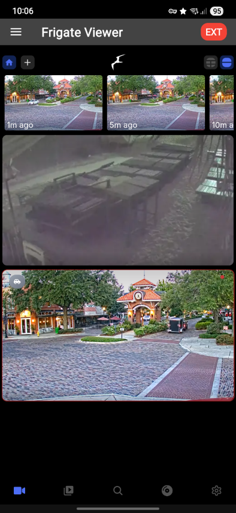
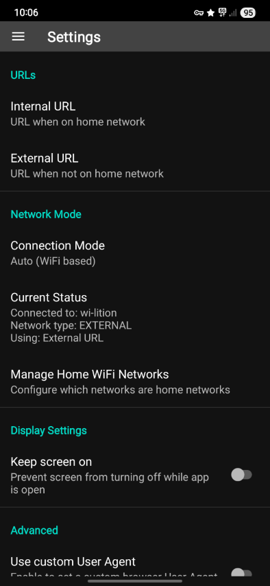

# Frigate Viewer

A seamless Android client for Frigate NVR that intelligently switches between local and remote URLs based on your network connection.

**This app is not part of the official Frigate NVR software.**

  

## Features

- **Network-Aware Switching**: Automatic URL selection based on WiFi network
- **Custom Network Lists**: Define which WiFi networks use your local URL
- **Flexible Connection Modes**: Auto, Internal-only, or External-only options
- **Optimized Video Playback**: Hardware-accelerated WebView with WebRTC support
- **Stability**: Automatic recovery from network changes
- **Internal SSL Support**: Self-signed certificates accepted for internal URLs only
- **Video/Image Downloads**: Save clips and snapshots with configurable storage location
- **Deep Linking**: Launch app via `freegate://` URLs for integration with other apps

## Permissions

- **Required**: Internet access, Network state monitoring
- **Network Detection**:
  - Android 13+: NEARBY_WIFI_DEVICES
  - Earlier versions: ACCESS_FINE_LOCATION
- **Optional**: Camera and microphone (for WebRTC features)

## Requirements

- Android 13+ recommended
- Frigate NVR with both local and remote access configured

## Downloads

Frigate Viewer supports downloading video clips and snapshots directly from your Frigate instance:

- **Automatic SSL Handling**: Downloads work seamlessly on both internal (self-signed) and external networks
- **Configurable Location**: Choose where to save files:
  - Downloads/Frigate (default)
  - Pictures folder (appears in Gallery)
  - Movies folder (appears in Gallery)
  - Downloads root folder
- **Progress Notifications**: Track download progress in the notification bar
- **Quick Access**: "Open" action on completion to view downloaded files

## Deep Linking

The app supports the `freegate://` URL scheme for integration with other apps:

- `freegate://home` or `freegate://cameras` - Open the main camera view
- `freegate://settings` - Open app settings
- `freegate://camera/[id]` - Open specific camera (future enhancement)
- `freegate://event/[id]` - Open specific event (future enhancement)

Example: Create shortcuts or integrate with automation apps using these URLs.

## Security & Privacy

- **Local Storage Only**: Downloaded files are stored locally per your preference
- **Isolation**: Keeping tokens, cookies, etc., in the app's private DOM storage rather than the device's web browser.
- **Viewer Only**: All processing remains on your Frigate server
- **Direct Connection**: No cloud services or intermediaries
- **No Telemetry**: No analytics or usage tracking
- **Secure Access**: Authentication handled by your Frigate instance
- **Certificate Handling**: Self-signed certificates accepted for internal connections only, standard certificates required for external URLs

## License

MIT License
